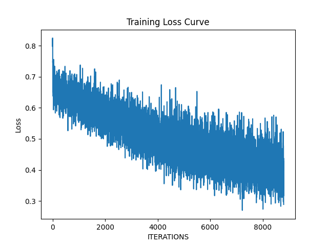
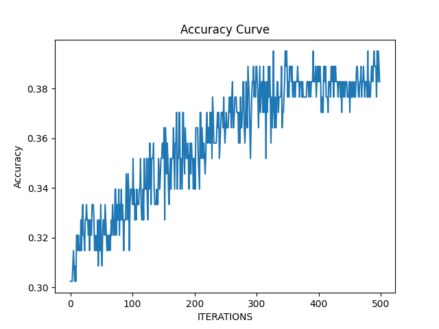

# Heart Attack Prediction
Heart Attack Predictor based on MLP(NPNet) using PyTorch.  
Dataset was downloaded from Kaggle: `https://www.kaggle.com/datasets/m1relly/heart-attack-prediction`  

# Training
Run `train.py` directly, and in the terminal you can see the training process include epoch, step and loss. 
After each epoch, the code will save checkpoint and run `predict.py` automatically to evaluate the accuracy of the model.  
If the model accuracy is higher than ever, the code will save `the best model`. 
 
                                                  Training loss curve 
 
                                                  Model accuracy curve 

# Predicting
the core codes are in `predict.py`. The function will be complete later.
